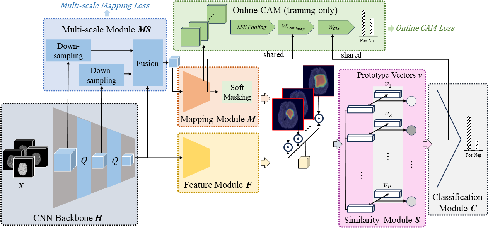
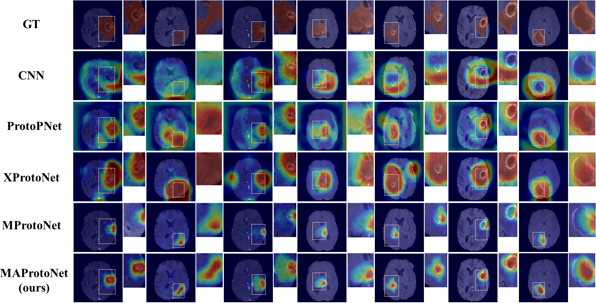

# MAProtoNet
Welcome to the official implementation of MAProtoNet (Multi-scale Attentive Prototypical Part Network).

MAProtoNet is an interpretable 3D MRI model for brain tumor classification, training on the public BraTS datasets. We improve the localization capability of the prototypical part networks for medicine imaging, by introducing the novel quadruplet attention layers as well as the multi-scale module.

[[Paper]](https://export.arxiv.org/abs/2404.08917)
[[Code]](https://github.com/TUAT-Novice/maprotonet)



Please check the following sections for more details:

|Repository Directory|
| --- |
| [Directory Structure](#Structure) |
| [Environments and Dependencies](#Environment) |
| [Datasets](#Datasets) |
| [Experiments Reproduction](#Experiments) |
| [Results](#Results) |
| [Acknowledgment](#Acknowledgment) |
| [TODO List](#TODO) |
| [Citation](#Citation) |

If necessary, please check further details from our paper "MAProtoNet: A Multi-scale Attentive Interpretable Prototypical Part Network for 3D Magnetic Resonance Imaging Brain Tumor Classification", or contact us through email: s237857s@st.go.tuat.ac.jp


## Directory Structure <a id="Structure"></a>
The directories of this repository are established as below:
* **data/** -- source codes for data processing
* **figures/**  -- images for this repository
* **models/**  -- source code for our MAProtoNet model
* **scripts/**  -- shell scripts for running
* **utils/**  -- source code for utility functions
* **requirements.txt**  -- environment configurations
* **run.sh** -- shell script to run our experiments
* **train.py**  -- source code for training and evaluation
* **tumor_cls_\*.py**  -- source code for the main function of our experiments
* **train_one_fold.py**  -- source code for training one cross-validation fold
* **visualization.ipynb**  -- code for visualization with a well-trained MAProtoNet

## Environments and Dependencies <a id="Environment"></a>
Python >= 3.10.9

Pytorch >= 2.0.1

The CUDA version we use is 11.7. Please use code like `torch==2.0.1 torchvision==0.15.2 torchaudio==2.0.2 --index-url https://download.pytorch.org/whl/cu117` to install the package according to your environments. Other required packages are in requirements.txt. Please run `pip install -r requirements.txt` to install them.

## Datasets <a id="Datasets"></a>
We employ [BraTS2018](https://www.med.upenn.edu/sbia/brats2018/), [BraTS2019](https://www.med.upenn.edu/cbica/brats-2019/), [BraTS2020](https://www.med.upenn.edu/cbica/brats2020/) datasets in our experiments. After applying for and downloading the datasets, for BraTS2018 dataset, please run data/get_mapping.py to generate name_mapping.csv before training.

## Experiments Reproduction <a id="Experiments"></a>
### Train and Test
Please download and prepare the BraTS datasets according to the [Datasets](#Datasets) section first. Then, you can modify and run the `run.sh` script as needed:

`bash run.sh`

To train the model, please set the `data_path` and `model` parameters in the script accordingly. To evaluate your well-trained model, please also provide a value for the `load_model` parameter. This value should be in the format like `maprotonet_eefb07f7`, where the first part is the model name and the second part is the hash code for the hyperparameters.

When you run the `run.sh` script, it will execute the downstream scripts located in `./scripts/run_XXX.sh` based on the `model=XXX` parameter you provide. If you want to further change the architecture of the models, please modify the scripts in that directory.

For multi-GPU training, you can modify the main script in the `run.sh` file to either `tumor_cls_spawn.py` or `tumor_cls_launch.py`. Both scripts will work for a single GPU, but if you have multiple GPUs, we highly recommend using `tumor_cls_launch.py`.

### Visualization
If you want to classify and attribute for 3D brain tumor MRI with your well-trained models, please check and follow the codes in `visualization.ipynb`.

### Our checkpoints
We also provide five model checkpoints, obtained through 5-fold cross-validation and used to report the results in our paper. You can download these checkpoints at:
[https://drive.google.com/drive/folders/1JShOsT1nacHYNPPFq2Ys3IiXV6yB-M-_?usp=sharing](https://drive.google.com/drive/folders/1JShOsT1nacHYNPPFq2Ys3IiXV6yB-M-_?usp=sharing).

If you want to evaluate MAProtoNet with our checkpoints, please download all five checkpoints and put them into `./results/models/`. Next, you can modify the `run.sh` script to set the `load_model` variable to `maprotonet_eefb07f7`, and then run the script to evaluate our model. Please note that due to differences in data partitioning for 5-fold cross-validation, your results may slightly differ from ours.

If you want to use our checkpoints for diagnosis and attribution, please follow the `visualization.ipynb` using the provided checkpoints.

## Results <a id="Results"></a>

Our experiments find that our MAProtoNet can achieve much better locolization capability with higher activation precision (AP) score, while maintaining similar balanced accuracy (BAC) and incremental deletion score (IDS) scores. The following tables are our results on BraTS2020 dataset, please see more details for our experiments through our paper. 

| Methods           | BAC &uarr; | AP &uarr; | IDS &darr;|
|:-----------------:|:-----:|:----:|:-----:|
| CNN               | 85.5 | 10.7 | 13.8 |
| ProtoPNet         | 84.3 | 11.8 | 24.2 |
| XProtoNet         | 84.7 | 16.9 | 16.3 |
| MProtoNet         | 85.8 | 81.2 | 6.2 |
| MAProtoNet (ours) | **86.7** | **85.8** | **6.2** |



## Acknowledgment <a id="Acknowledgment"></a>
This repository is established upon the source code of MProtoNet, from https://github.com/aywi/mprotonet developed by Yuanyuan Wei, Roger Tam and Xiaoying Tang. We appreciate their work.


## TODO List <a id="TODO"></a>
- [X] Code for multi-gpu running


## Citation <a id="Citation"></a>
If you found this repository helpful, please consider citing:
```bibtex
@article{
binghua_maprotonet_2024,
author = {Binghua, Li and Jie, Mao and Zhe, Sun and Chao, Li and Qibin, Zhao and Toshihisa, Tanaka},
title = {{MAP}roto{N}et: A Multi-scale Attentive Interpretable Prototypical Part Network for 3{D} Magnetic Resonance Imaging Brain Tumor Classificati},
journal = {arXiv preprint arXiv: 2404.08917},
year = {2024},
month = {Apr},
url = {http://arxiv.org/abs/2404.08917},
publisher = {{arXiv}},
}
```


